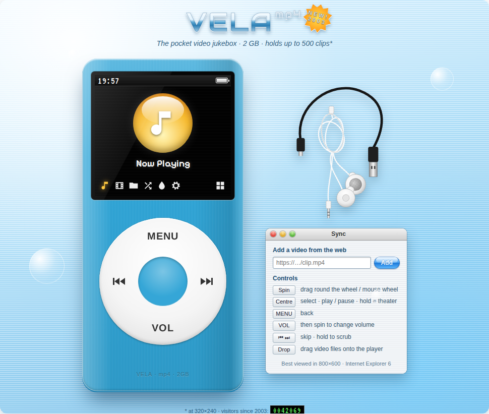

# VELA mp4

An early-2000s pocket video player that runs in a Jupyter notebook. Videos play on the
little LCD, and you control everything with the click wheel.

- **`vela_mp4_player.ipynb`**: the notebook. Run all cells and the player appears in the output.
  Add your own videos with `library.add("clip.mp4")`, a URL, or the **Load Files** menu.
- **`vela_player.html`**: a standalone copy of the player, exported with `save_player()`. You can
  open it in any browser.

Fonts: Pixelify Sans (LCD), VT323 (clock and timecodes), Arimo Bold (wheel labels),
Audiowide (logo), and Trebuchet MS / Tahoma / Verdana (page text).
